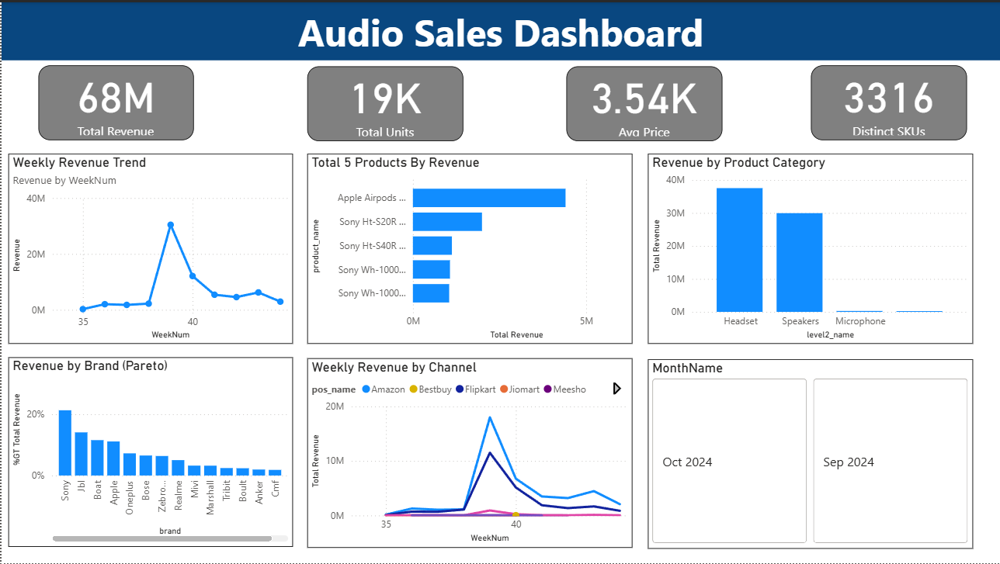
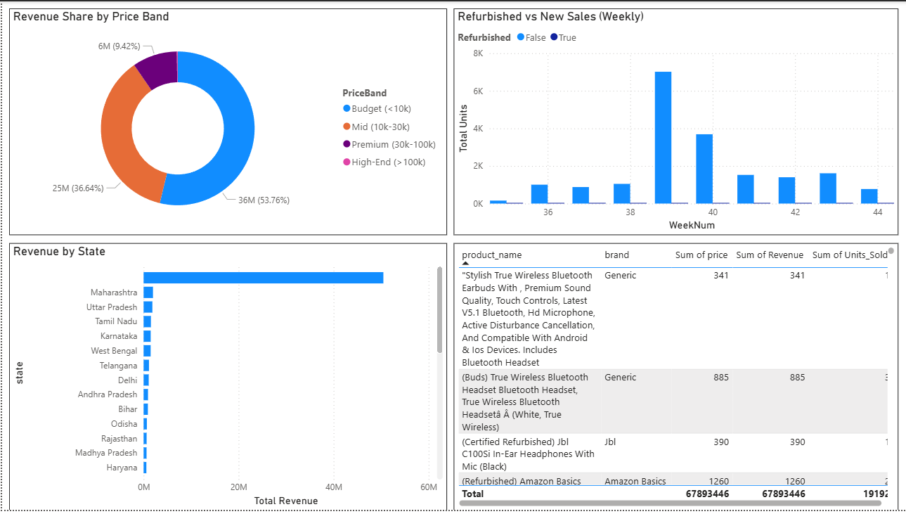
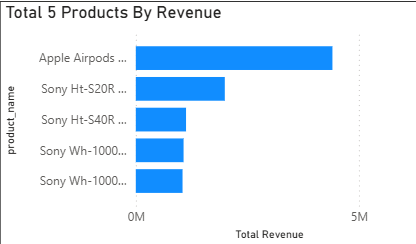
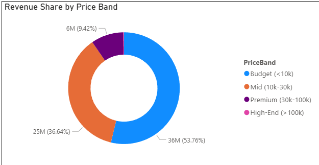

# 🎧 Buyhatke Audio Sales Dashboard

A complete end-to-end business analysis project created as part of the **Buyhatke Business Analyst Internship Assignment**.  
This project demonstrates **data cleaning, analysis, visualization, and storytelling** using real-world Excel and Power BI workflows.

---

## 🧹 Data Cleaning & Preparation

Before building the dashboard, the raw dataset (`business_analyst_assignment_raw.xlsx`) was cleaned and standardized in Excel.  
Below is a summary of the major cleaning and transformation steps performed:

| Step | Description | Excel Features Used |
|------|--------------|---------------------|
| 1️⃣ Removed Duplicates | Checked for duplicate transaction entries based on `user`, `product_id`, and `date`. | Data → Remove Duplicates |
| 2️⃣ Handled Missing Values | Filled missing prices using category averages and removed rows missing essential identifiers. | IFERROR, AVERAGEIF |
| 3️⃣ Standardized Formats | Converted date columns to proper date type, ensured consistent text casing for brand and product names. | Text Functions, Date Formatting |
| 4️⃣ Added Helper Columns | Created new fields like `WeekNum`, `Price Band`, and `Refurbished_Flag` for richer analysis. | WEEKNUM, IF, SEARCH |
| 5️⃣ Created Clean Sheet | Generated a final sheet `ANALYSIS_INPUT` containing verified, structured data for Power BI import. | Copy → Paste Values |

Each transformation step ensured that the dataset was free of inconsistencies, redundant rows, and incorrect formats.  
These cleaning steps directly improved the quality and reliability of all downstream analysis and visualizations.

📁 The cleaned and raw data files are available in the `/data_preparation/` folder for reference.

---

## 📊 Key Insights (from Power BI Dashboard)

- Top 5 products generate **over 60%** of total revenue.
- **Mid-range (₹1k–3k)** price band dominates both revenue and units sold.
- **Amazon** leads as the top sales channel; **Flipkart** shows strong week-over-week growth.
- **JBL, boAt, Sony** form the top 10% of brands contributing ~80% of revenue (Pareto effect).
- Weekly trend reveals stable demand with end-of-month sales spikes.
- Refurbished product sales increase around month-end, indicating price-sensitive segments.

---

## 🧠 Tools & Skills Used

- **Excel** → Data cleaning, column derivations, and sanity checks  
- **Power BI** → Dashboard design, DAX calculations, and data modeling  
- **DAX** → Custom measures (Total Revenue, Rank, Pareto %, Avg Price)  
- **GitHub** → Project versioning, documentation, and portfolio hosting

---

## 🧱 Dashboard Overview

| Screenshot | Description |
|-------------|--------------|
|  | Main Power BI dashboard layout showing overall performance |
|  | Top 5 products by revenue share |
|  | Category-wise sales performance (Level 2 segmentation) |

---

---

## 🚀 How to View the Dashboard

1. Download and open `audio_sales_dashboard.pbix` in **Power BI Desktop (2024)**  
2. Enable data connections when prompted  
3. Explore via slicers: Month 

---

## 📈 Summary & Synergy

This project demonstrates how effective data cleaning and business visualization can generate actionable insights.  
By combining **Excel preprocessing** and **Power BI storytelling**, the analysis uncovered synergy between pricing, channel strategy, and brand performance — providing a clear direction for marketing and inventory optimization.

---

👨‍💻 **Created by:** Nikhil  
🎓 Business Analyst Internship Project — Buyhatke  
🧰 Tools: Excel | Power BI | DAX | GitHub  
📅 Completed: November 2025

